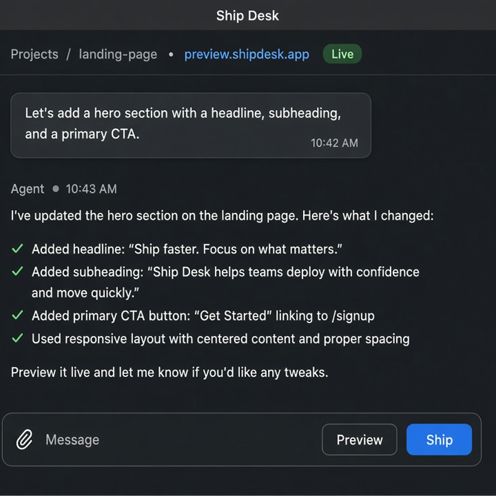

# Ship Desk

Ship Desk is a macOS desk app (Tauri + Lit) built on the [Pi Desktop](https://github.com/LCorleone/pi-desktop) agent shell. Talk in chat, let the Pi agent edit files in a project folder, **Preview** locally or on Vercel, and **Ship** to production in one click.

**Preview is free. Live is one click. Domain is dessert.**

<p align="left">
  
</p>

---

## MVP features

- **Projects + threads** sidebar (Pi sessions), restrained dark three-pane layout
- **Agent loop** via `pi --mode rpc` (same as Pi Desktop)
- **Preview** — opens your Vercel live URL when deployed, otherwise starts a local static preview (`localhost:3456`)
- **Ship** — runs `vercel deploy --prod --yes` from the project directory
- **Deploy panel** — provider, status, live URL; domain shows **Not set** with disabled **Connect domain…**

---

## Requirements (macOS, Apple Silicon)

- **Node.js ≥ 22**
- **Rust** toolchain + [Tauri 2 prerequisites](https://v2.tauri.app/start/prerequisites/)
- **Pi CLI**: `npm install -g @earendil-works/pi-coding-agent`
- **Vercel** (for Ship):
  - `npm install -g vercel` and `vercel login`, **or**
  - a `VERCEL_TOKEN` saved in **Settings → General → Vercel** (optional if CLI is logged in)

You can also export `VERCEL_TOKEN` in your shell before launching the app; the token in Settings is stored in Ship Desk’s app data `settings.json`.

---

## Run from source (macOS)

```bash
npm install
npm run tauri dev
```

Production build (unsigned `.dmg` / `.app` in `src-tauri/target/release/bundle/`):

```bash
npm install
npm run tauri build
```

On Apple Silicon, run these natively on macOS (this repo is developed in CI/Linux but targets macOS bundles).

---

## Using Ship Desk

1. **Open or create a project folder** from the sidebar (+ on a project).
2. Chat with the agent to scaffold or edit a site (`index.html`, or a Next/Vite app).
3. **Preview** — local dev server or your live Vercel URL after shipping.
4. **Ship** — deploys with the Vercel CLI. If credentials are missing, the Deploy panel and composer show a clear error with setup steps (no silent no-op).

Deploy metadata is stored per project at `.ship-desk/deploy.json`.

---

## Icons

Source artwork: `assets/branding/ship-desk-icon-source.png` (cropped from the Ship Desk mascot).

Regenerate platform icons:

```bash
npx tauri icon assets/branding/ship-desk-icon-source.png -o src-tauri/icons
```

---

## Architecture

- **Frontend**: Lit + TypeScript (`src/`)
- **Backend**: Tauri 2 / Rust — Pi RPC, PTY, Vercel deploy commands (`src-tauri/`)
- **Agent**: `@earendil-works/pi-coding-agent` (`pi --mode rpc`)

---

## Credit

Fork of [`LCorleone/pi-desktop`](https://github.com/LCorleone/pi-desktop) / [`gustavonline/pi-desktop`](https://github.com/gustavonline/pi-desktop). Pi session runtime and extensions are upstream work.

## License

MIT — see [`LICENSE`](./LICENSE).
